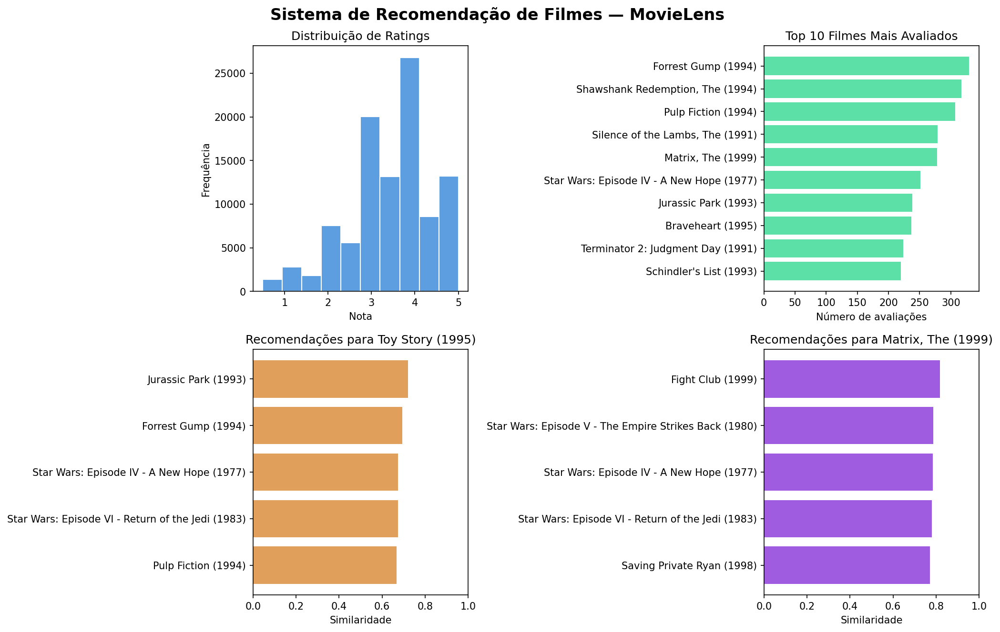

# Sistema de Recomendação de Filmes — MovieLens

Sistema de recomendação por filtragem colaborativa que sugere filmes baseado no comportamento de avaliação de usuários reais, usando similaridade de cosseno entre filmes.

## Como foi feito

O sistema usa **filtragem colaborativa baseada em itens** — em vez de analisar o conteúdo dos filmes, analisa o padrão de avaliação dos usuários. Se as mesmas pessoas que gostaram de Toy Story também gostaram de Jurassic Park, os dois filmes são considerados similares.

O processo:
1. Filmes com menos de 50 avaliações e usuários com menos de 50 avaliações foram removidos para garantir qualidade
2. Uma matriz usuário x filme foi construída com as notas
3. A similaridade de cosseno foi calculada entre todos os pares de filmes
4. O sistema retorna os N filmes mais similares ao filme consultado

## Base de dados

Dataset real MovieLens Small com dados reais de avaliações:

| Dado | Valor |
|---|---|
| Total de filmes | 9.742 |
| Total de avaliações | 100.836 |
| Total de usuários | 610 |
| Nota média | 3.5 / 5.0 |
| Filmes após filtro | 450 |
| Usuários após filtro | 268 |

## Exemplos de recomendação

**Toy Story (1995)**
| Filme | Similaridade |
|---|---|
| Jurassic Park (1993) | 0.720 |
| Forrest Gump (1994) | 0.693 |
| Star Wars: Episode IV (1977) | 0.674 |
| Star Wars: Episode VI (1983) | 0.673 |
| Pulp Fiction (1994) | 0.667 |

**Matrix, The (1999)**
| Filme | Similaridade |
|---|---|
| Fight Club (1999) | 0.818 |
| Star Wars: Episode V (1980) | 0.788 |
| Star Wars: Episode IV (1977) | 0.785 |
| Star Wars: Episode VI (1983) | 0.780 |
| Saving Private Ryan (1998) | 0.771 |

## O que é similaridade de cosseno

Mede o ângulo entre dois vetores — no nosso caso, os vetores de avaliação de dois filmes. Valor 1.0 significa padrão de avaliação idêntico, 0.0 significa sem relação. Não é afetada pela escala, apenas pelo padrão — um usuário que dá notas altas pra tudo não distorce o resultado.

## Tecnologias

- Python 3
- pandas e NumPy — manipulação e construção da matriz
- scikit-learn — cálculo de similaridade de cosseno
- matplotlib — visualizações

## Como rodar

1. Clique no badge **Open in Colab** acima
2. Vá em `Runtime > Run all`
3. O dataset MovieLens é baixado automaticamente

## Resultado

